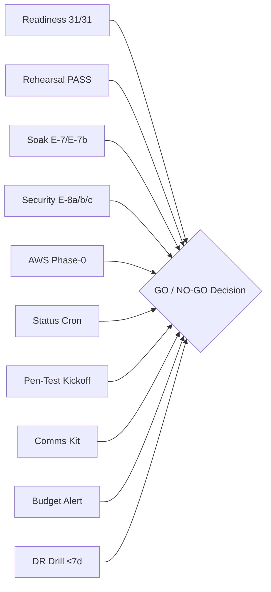

# FinText Alpha Vectorizer — Private-Beta Go / No-Go Decision Gate
═══════════════════════════════════════════════════════════════════════════════
Document ID: GATE-BETA-GO-NOGO-2026-V1  
Classification: FOUNDER GOVERNANCE & LAUNCH AUTHORIZATION  
Target System: FinText Alpha Vectorizer v1.0.0-rc1  
Effective Date: September 26, 2026  
Responsible Board Leads: CTO (Chair), SRE Lead, Security Architect, Compliance Officer, FinOps Analyst  
Change Control: All status changes via git commit only — no silent edits.  
═══════════════════════════════════════════════════════════════════════════════

## 1. Purpose & Decision Framework

This document is the binding, authoritative launch gate for the FinText Alpha Vectorizer Private Beta. Every gate must reach **DONE** (with evidence pointer) or **WAIVED** (with inline founder signature and rationale) before the Cohort-1 invitation proceeds.

**Status Column Values (enumerated, no others permitted):**
- `PENDING` — Not yet completed or evidenced
- `DONE` — Completed with repo-local evidence verified
- `WAIVED` — Consciously skipped; requires `WAIVED by: [Founder Name], [Date], Reason: [text]` inline

> **Honest Baseline Note (Commit Time):** All 10 gates are committed as PENDING.
> This is the honest starting state. Gates transition to DONE only when founder
> executes each action and commits the status change with evidence.

---

## 2. Go / No-Go Gate Table

```
┌─────────────────────────────────────────────────────────────────────────────────────────────────────────┐
│                            PRIVATE BETA GO / NO-GO DECISION GATES (G1–G10)                             │
├──────┬──────────────────────────────────────────┬───────────┬───────────────────────────────────────────┤
│ Gate │ Gate Description                         │ Status    │ Evidence Pointer                          │
├──────┼──────────────────────────────────────────┼───────────┼───────────────────────────────────────────┤
│ G1   │ Readiness Audit 31/31 at Launch Moment   │ PENDING   │ scripts/verify_private_beta_readiness.py  │
│      │ (30 existing + Check 31 = rehearsal)     │           │ → stdout "31/31 PASSED"                  │
├──────┼──────────────────────────────────────────┼───────────┼───────────────────────────────────────────┤
│ G2   │ Latest beta_rehearsal_ledger Line = PASS │ PENDING   │ logs/beta_rehearsal_ledger.md             │
│      │ (full E2E drill certified on this HEAD)  │           │ → last row Verdict = PASS                │
├──────┼──────────────────────────────────────────┼───────────┼───────────────────────────────────────────┤
│ G3   │ Founder Tracker E-7 + E-7b Evidence      │ PENDING   │ docs/FOUNDER_ACTION_TRACKER.md §E-7/E-7b │
│      │ (Soak scheduler + 24h baseline proof)    │           │ logs/soak_ledger.md (≥24h contiguous)    │
├──────┼──────────────────────────────────────────┼───────────┼───────────────────────────────────────────┤
│ G4   │ Founder Tracker E-8a/b/c Evidence        │ PENDING   │ docs/FOUNDER_ACTION_TRACKER.md §E-8a/b/c │
│      │ (2FA enforced, PATs revoked, pw rotated) │           │ logs/founder_actions_evidence.md          │
├──────┼──────────────────────────────────────────┼───────────┼───────────────────────────────────────────┤
│ G5   │ AWS Phase-0 Smoke Green                  │ PENDING   │ docs/PRODUCTION_DEPLOYMENT_RUNBOOK.md §4  │
│      │ (terraform apply + healthcheck pass)     │           │ logs/infra_validate_report.json           │
├──────┼──────────────────────────────────────────┼───────────┼───────────────────────────────────────────┤
│ G6   │ STATUS_URL Secret Set + First Live Cron  │ PENDING   │ .github/workflows/status.yml             │
│      │ (GitHub Actions status cron run green)    │           │ → Actions tab: latest run ✅              │
├──────┼──────────────────────────────────────────┼───────────┼───────────────────────────────────────────┤
│ G7   │ Pen-Test Vendor Selected + Kickoff Date  │ PENDING   │ docs/PENTEST_PLAN.md §2 vendor matrix    │
│      │ (within PENTEST_PLAN assessment window)   │           │ kickoff date inside Oct 1–Nov 15 window  │
├──────┼──────────────────────────────────────────┼───────────┼───────────────────────────────────────────┤
│ G8   │ Cohort-1 Comms Kit Approved              │ PENDING   │ docs/PRIVATE_BETA_ONBOARDING_RUNBOOK.md  │
│      │ (welcome email, credentials handoff SOP)  │           │ §Cohort-1 Comms Kit                      │
├──────┼──────────────────────────────────────────┼───────────┼───────────────────────────────────────────┤
│ G9   │ AWS Budgets Alert at $301.44 Configured  │ PENDING   │ infra/terraform/budgets.tf               │
│      │ (monthly cap alarm active on AWS account) │           │ AWS Console → Budgets screenshot         │
├──────┼──────────────────────────────────────────┼───────────┼───────────────────────────────────────────┤
│ G10  │ DR Drill Within Last 7 Days              │ PENDING   │ logs/dr_ledger.md                        │
│      │ (dr_weekly_drill PASS, RTO < 4h)         │           │ → last row ≤ 7 days old, Status=PASS     │
└──────┴──────────────────────────────────────────┴───────────┴───────────────────────────────────────────┘
```

---

## 3. Decision Record

### GO Decision (requires ALL G1–G10 = DONE or WAIVED)

```
┌────────────────────────────────────────────────────────────────────────────────────┐
│ Decision:     [ ] GO — Proceed with Cohort-1 Invitations                          │
│               [ ] NO-GO — Block until failing gates resolved                      │
│                                                                                    │
│ Gates Status: ___/10 DONE  |  ___/10 WAIVED  |  ___/10 PENDING                   │
│                                                                                    │
│ Founder Signature: ________________________________________                        │
│ Date:              ________________________________________                        │
│ Git Commit SHA:    ________________________________________                        │
└────────────────────────────────────────────────────────────────────────────────────┘
```

### NO-GO Escalation Path

If any gate cannot be resolved within the launch window:

1. **Patch Window:** Identify minimum fix scope → branch → PR → merge → re-run rehearsal.
2. **Comms Template:** Send delay notification to Cohort-1 pipeline using the template below:

```
Subject: FinText Alpha — Private Beta Access Update

Dear [Client Contact],

Thank you for your continued interest in FinText Alpha Vectorizer. We are
completing final security and operational certifications for institutional
deployment. We will confirm your onboarding window within [N] business days.

In the interim, our status page at {{STATUS_URL}} provides real-time
platform health visibility.

Best regards,
FinText Alpha Vectorizer — Platform Engineering Team
```

3. **Re-Gate:** After patch merged, re-run full rehearsal harness, verify all 10 gates, and re-sign this document.

---

## 4. Gate Dependency Map



---

## 5. Revision History

| Date | Author | Change |
| :--- | :--- | :--- |
| 2026-09-26 | Platform Engineering Board | Initial creation — all 10 gates PENDING (honest baseline) |
