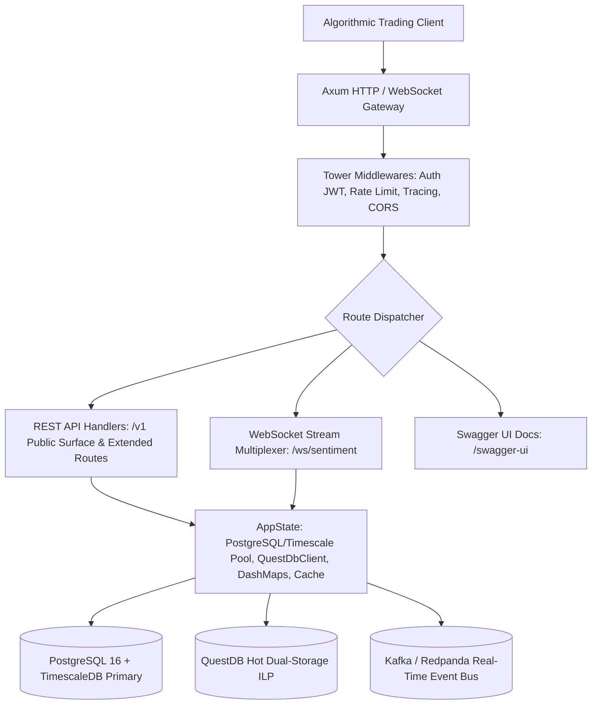

# FinText Axum API Gateway (`fintext_api_server`)

> **Last Verified**: 2026-09-10 (Suite #96) | **Audit Readiness**: Certified Clean | **Authoritative Deprecations**: [`docs/DEPRECATED.md`](../../docs/DEPRECATED.md)

## 1. Module Name & Purpose
`fintext_api_server` is the primary high-performance HTTP REST and WebSocket streaming gateway for the FinText Alpha Vectorizer platform. Built on `axum`, `tokio`, and `tower`, it serves the public versioned `/v1` API surface (32 core endpoints) alongside specialized institutional endpoints for quantitative alpha signals, real-time sentiment streams, options microstructure (VPIN/GEX), Point-in-Time (PIT) replay, supply chain risk propagation, and multi-tenant enterprise governance to algorithmic trading systems with sub-millisecond response latencies.

## 2. Module Overview Table
| Sub-Module / File | Purpose & Responsibilities |
| :--- | :--- |
| **`handlers/`** | Specialized HTTP request controllers across 46 active modules supporting 32 core `/v1` endpoints (sentiment, options IV, PIT replay, supply chain risk, webhooks, audio transcription, etc.). |
| **`auth.rs` & `users.rs`** | JWT token lifecycle, Argon2id password hashing, rotating API keys (`fintext_live_...`), and RBAC user permissions. |
| **`quality.rs`** | Quantitative Data Quality Scoring (QDQS) engine calculating reliability weights, length factors, and spam penalties. |
| **`rate_limit.rs`** | Thread-safe in-memory sliding-window rate limiters per user, organization, and IP. |
| **`openapi.rs`** | Full OpenAPI 3.0 / Swagger UI documentation generation using `utoipa` and `utoipa-swagger-ui` (`/v1` public specification). |
| **`streaming/`** | Real-time WebSocket feed multiplexer and Kafka topic streaming endpoints. |
| **`billing.rs`** | Stripe billing integration, checkout sessions, customer billing portal, and subscription plan enforcement. |
| **`supply_chain.rs`** | Multi-tier supply chain shock propagation and graph dependency analytics. |
| **`pit.rs`** | Bi-temporal Point-in-Time (PIT) historical backtesting engine with strict survivorship bias prevention. |
| **`orgs.rs` & `ip_whitelist.rs`** | Multi-user enterprise team access, invitation flows, and CIDR IP access control. |
| **`storage/`** | High-throughput client connectors for PostgreSQL 16 + TimescaleDB primary storage and QuestDB hot time-series dual-storage. |
| **`anomaly_worker.rs`** | Background task scanner detecting multi-sigma sentiment and latency deviations. |

## 3. Architecture


## 4. Dependencies
| Dependency | Version | Purpose |
| :--- | :--- | :--- |
| `axum` | `0.7` | High-performance asynchronous web routing engine |
| `tokio` | `1.36` | Asynchronous multi-threaded runtime |
| `utoipa` / `utoipa-swagger-ui` | `4.2 / 7.1` | Automated OpenAPI 3.0 generation and interactive Swagger UI |
| `sqlx` | `0.7` | Asynchronous PostgreSQL client with compile-time checked queries |
| `jsonwebtoken` / `argon2` | `9.3 / 0.5` | Secure JWT signature validation and Argon2id password hashing |
| `arrow` / `parquet` | `53` | Apache Arrow column-oriented Parquet dataset export |
| `rdkafka` | `0.36` | Real-time Kafka consumer and event stream broadcasting |
| `dashmap` | `5.5` | High-concurrency lock-free concurrent hash maps |

## 5. Public API Highlights
- `pub fn create_router(state: AppState) -> Router`: Constructs the full Axum application router with all routes, OpenAPI UI, and middleware.
- `pub struct AppState`: Thread-safe shared application context containing database pools, rate limiters, and configurations.
- `pub async fn run_server(config: ServerConfig) -> Result<(), Box<dyn std::error::Error>>`: Entry point to launch the gateway.

## 6. Testing & Running
Run comprehensive unit and integration test suite:
```bash
cargo test -p fintext_api_server
```

Launch the API server locally:
```bash
cargo run --release -p fintext_api_server
# API Server active on http://127.0.0.1:8000
# Interactive Swagger UI: http://127.0.0.1:8000/swagger-ui
```

## 7. Related Modules
- [`fintext_ingestion_engine`](../ingestion_engine): Populates the live signals consumed by API endpoints.
- [`fintext_spillover_engine`](../spillover_engine): Provides lead-lag analytics queried by risk endpoints.
- [`fintext_dead_letter_worker`](../dead_letter_worker): Monitored by the API server's `/admin/dlq` handlers.
