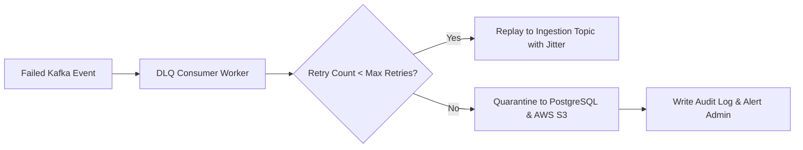

# FinText Dead Letter Queue Worker (`fintext_dead_letter_worker`)

> **Last Verified**: 2026-09-10 (Suite #96) | **Audit Readiness**: Certified Clean | **Authoritative Deprecations**: [`docs/DEPRECATED.md`](../../docs/DEPRECATED.md)

## 1. Module Name & Purpose
`fintext_dead_letter_worker` is a reliable message recovery and quarantine service for the FinText Alpha Vectorizer platform. It monitors Kafka Dead Letter Queues (DLQ), applies configurable exponential backoff retry policies, routes permanently failing poison messages to S3/PostgreSQL quarantine storage, and exposes audit statistics to ensure zero data loss across financial pipelines.

## 2. Architecture
- **Queue Consumer (`worker.rs`)**: Subscribes to failed Kafka DLQ topics (`sentiment-dlq`).
- **Retry Engine (`retry.rs`)**: Implements exponential backoff with randomized jitter to prevent thundering herd retries.
- **Quarantine Store (`quarantine.rs`)**: Persists unrecoverable poison events to PostgreSQL and archival AWS S3 / MinIO buckets for post-mortem analysis.
- **Worker Configuration (`config.rs`)**: Manages retry ceilings, S3 bucket names, and database connection pools.



## 3. Dependencies
| Dependency | Version | Purpose |
| :--- | :--- | :--- |
| `tokio` | `1.36` | Asynchronous worker runtime |
| `rdkafka` | `0.36` | High-throughput native Kafka consumer and replay producer |
| `aws-sdk-s3` | `1.38` | AWS S3 / MinIO object storage client for quarantine archives |
| `sqlx` | `0.7` | PostgreSQL query execution for quarantine tables |
| `dashmap` | `5.5` | In-memory message retry counter tracking |
| `uuid` / `chrono` | `1.7 / 0.4` | Unique incident ID generation and UTC timestamps |

## 4. Public API
- `pub struct DeadLetterWorker`: Asynchronous background worker consuming and processing DLQ events.
- `pub struct DlqConfig`: Configuration model (`kafka_bootstrap_servers`, `max_retries`, `quarantine_bucket`, `postgres_url`).
- `pub struct QuarantineStore`: Storage adapter persisting unrecoverable events to database and S3.
- `pub struct RetryPolicy`: Calculates backoff duration based on retry attempt count.

## 5. Testing & Running
Run unit and integration tests:
```bash
cargo test -p fintext_dead_letter_worker
```

Run the DLQ worker daemon:
```bash
cargo run --release -p fintext_dead_letter_worker
```

## 6. Usage Example
```rust
use fintext_dead_letter_worker::RetryPolicy;
use std::time::Duration;

let policy = RetryPolicy::new(3, Duration::from_millis(500), 2.0);
let delay = policy.calculate_backoff(2);

println!("Backoff delay for attempt 2: {:?}", delay);
```

## 7. Related Modules
- [`fintext_ingestion_engine`](../ingestion_engine): Source of streaming events that may fail on transient errors.
- [`fintext_api_server`](../api_server): Exposes `/admin/dlq` endpoints for manual inspection and replay triggers.
