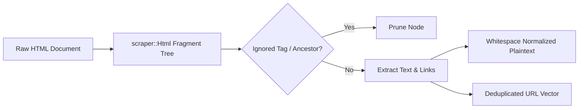

# FinText HTML Sanitizer (`fintext_html_sanitizer`)

> **Last Verified**: 2026-09-10 (Suite #96) | **Audit Readiness**: Certified Clean | **Authoritative Deprecations**: [`docs/DEPRECATED.md`](../../docs/DEPRECATED.md)

## 1. Module Name & Purpose
`fintext_html_sanitizer` is a high-throughput, zero-copy native HTML cleaning and metadata extraction engine. It removes boilerplate, scripts, styling, navigation, and advertisement tracking markup from raw financial feeds (SEC EDGAR filings and Finnhub market news) while extracting clean plaintext and deduplicated hyperlink targets.

## 2. Architecture
The crate uses `scraper::Html` to parse fragments into a lightweight DOM tree:
- **Tag Filtering**: Drops non-content elements (`<script>`, `<style>`, `<iframe>`, `<svg>`, `<nav>`, `<footer>`, `<aside>`, `<form>`, `<button>`, `<input>`, ``) via `IGNORED_TAGS`.
- **Ancestor Traversal**: Verifies parent hierarchy to ensure nested ignored blocks are stripped completely.
- **Link Extraction**: Parses `a[href]` nodes via `LINK_SELECTOR`, normalizing and deduplicating absolute and relative URLs.
- **Whitespace Normalization**: Collapses multi-line and irregular whitespace runs using precompiled lazy regexes.



## 3. Dependencies
| Dependency | Version | Purpose |
| :--- | :--- | :--- |
| `scraper` | `0.18` | Fast HTML5 DOM tree parsing using `html5ever` |
| `regex` | `1.10` | Whitespace normalization regex |
| `once_cell` | `1.19` | Lazy static compilation of tag sets and selectors |
| `pyo3` | `0.29` | Optional Python C-extension bindings (`cdylib`) |

## 4. Public API
- `pub fn clean_html(html: &str) -> String`: Cleans HTML markup and returns sanitized plaintext.
- `pub fn extract_links(html: &str) -> Vec<String>`: Extracts all valid, deduplicated hyperlinks.
- `pub struct RustHtmlSanitizer`: PyO3 class wrapper for Python interoperability.

## 5. Testing
Run crate unit tests:
```bash
cargo test -p fintext_html_sanitizer
```

## 6. Usage Example
```rust
use fintext_html_sanitizer::{clean_html, extract_links};

let raw_html = "<div class='article'><p>Apple Inc. $AAPL posted record revenue. <a href='https://sec.gov'>SEC Filing</a></p></div>";
let clean_text = clean_html(raw_html);
let urls = extract_links(raw_html);

assert_eq!(clean_text, "Apple Inc. $AAPL posted record revenue. SEC Filing");
assert_eq!(urls, vec!["https://sec.gov"]);
```

## 7. Related Modules
- [`fintext_ingestion_engine`](../ingestion_engine): Preprocesses incoming documents in the primary ingestion loop.
- [`fintext_rust_sidecar`](../sidecar): Uses the sanitizer for standalone microservice preprocessing.
