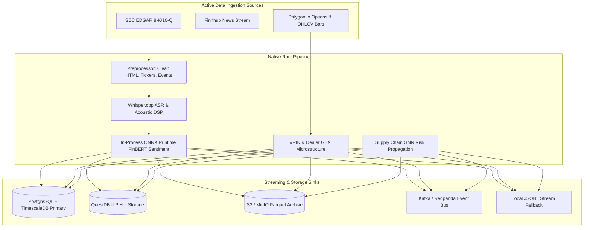

# FinText Native Ingestion Engine (`fintext_ingestion_engine`)

> **Last Verified**: 2026-09-10 (Suite #96) | **Audit Readiness**: Certified Clean | **Authoritative Deprecations**: [`docs/DEPRECATED.md`](../../docs/DEPRECATED.md)

## 1. Module Name & Purpose
`fintext_ingestion_engine` is the core high-performance ingestion daemon and analytical signal generation engine of the FinText Alpha Vectorizer platform. It continuously ingests regulatory filings and financial news from active sources (SEC EDGAR, Finnhub, Polygon.io), executes in-process static shape ONNX FinBERT sentiment inference (fine-tuned INT8 v3.1.0 primary with base FinBERT v3.0.0 and MiniLM v2.1.0 headline fallbacks), transcribes earnings call audio via Whisper.cpp, computes options microstructure (VPIN and Dollar Gamma Exposure), evaluates Supply Chain GNN risk propagation, and streams tradeable signals to PostgreSQL/TimescaleDB primary storage, QuestDB hot path, and Kafka within a strict 437ms SLA.

## 2. Module Overview Table
| Sub-Module | Primary Files | Functionality & Role |
| :--- | :--- | :--- |
| **`sources`** | `sec_edgar.rs`, `finnhub.rs`, `polygon.rs` | Active market data & regulatory filing pollers (Public SEC EDGAR, Finnhub news, Polygon options & daily OHLCV bars). |
| **`nlp`** | `onnx_sentiment.rs`, `ner.rs` | Native in-process ONNX Runtime sentiment classifier (FinBERT) & Named Entity Recognition (ORG/LOC/MISC). |
| **`audio`** | `transcriber.rs`, `feature_extractor.rs` | Native Whisper.cpp ASR audio transcriber and acoustic DSP feature extractor (F0 pitch, RMS energy, pause ratio). |
| **`alpha`** | `microstructure.rs`, `gnn.rs` | Microstructure engine: Volume-Synchronized Probability of Informed Trading (VPIN), Black-Scholes Dealer GEX, and 2-layer symmetric normalized Laplacian Supply Chain GNN. |
| **`pipeline`** | `preprocessor.rs` | Document normalization pipeline integrating HTML sanitation, ticker extraction, event classification, and spam filtering. |
| **`storage`** | `timescaledb.rs`, `questdb.rs`, `raw_archive.rs`, `sink.rs` | PostgreSQL 16 + TimescaleDB primary persistence, QuestDB ILP hot persistence, S3 Parquet raw archiving, and local JSONL fallback buffer. |
| **`streaming`** | `kafka_sink.rs` | Asynchronous Redpanda/Kafka event producer for real-time downstream processing. |
| **`telemetry`**| `metrics.rs` | Atomic performance counters tracking preprocessing latency, throughput, and error rates. |
| **`ipc`** | `bridge.rs` | Zero-copy IPC serialization definitions for Python communication. |

## 3. Architecture & Data Flow


## 4. Dependencies
| Dependency | Version | Purpose |
| :--- | :--- | :--- |
| `ort` | `2.0.0-rc.4` | Native Microsoft ONNX Runtime execution with CUDA/TensorRT fallback |
| `tokenizers` | `0.21` | Hugging Face HuggingFace fast tokenizer library |
| `whisper-rs` | `0.11` | In-process OpenAI Whisper automatic speech recognition |
| `rdkafka` | `0.36` | High-throughput native Kafka producer/consumer |
| `reqwest` | `0.11` | Async HTTP client for active data source REST pollers |
| `nalgebra` / `rustfft` | `0.33 / 6.1` | Linear algebra for GNN Laplacian and acoustic FFT signal processing |
| `hound` | `3.5` | WAV audio file decoding |
| `fintext_*` | internal | In-process sanitizer, ticker extractor, spam detector, event classifier |

## 5. Public API Highlights
- `pub struct Preprocessor`: Processes `RawDocument` into `ProcessedDocument`.
- `pub fn compute_sentiment_onnx(text: &str) -> Result<SentimentOutput, String>`: Returns sentiment score, label, and class probabilities.
- `pub async fn compute_vpin_and_gex_from_polygon(...) -> Result<(f64, GexResult), String>`: Computes VPIN and Dealer GEX.
- `pub fn decode_audio_file(path: &Path) -> Result<(Vec<f32>, u32), String>`: Decodes WAV audio.
- `pub async fn transcribe_samples_async(samples: Vec<f32>) -> Result<String, String>`: ASR transcription.
- `pub struct QuestDbSink`, `pub struct KafkaSink`: Storage & streaming connectors.

## 6. Testing & Running
Run unit and integration tests:
```bash
# Note: On Windows, set LIBCLANG_PATH to venv\Lib\site-packages\clang\native if needed
cargo test -p fintext_ingestion_engine
```

Run the ingestion engine daemon:
```bash
cargo run --release -p fintext_ingestion_engine
```

## 7. Related Modules
- [`fintext_api_server`](../api_server): Serves processed signals and live streams via REST and WebSockets.
- [`fintext_spillover_engine`](../spillover_engine): Analyzes cross-asset correlation matrices over QuestDB data.
- [`fintext_dead_letter_worker`](../dead_letter_worker): Handles failed ingestion and streaming events.
