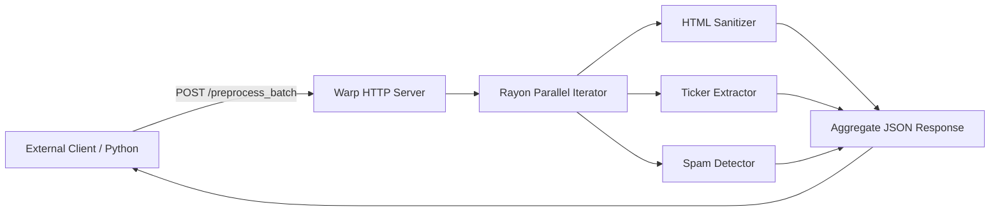

# FinText Preprocessing Sidecar (`fintext_rust_sidecar`)

> **Last Verified**: 2026-09-10 (Suite #96) | **Audit Readiness**: Certified Clean | **Authoritative Deprecations**: [`docs/DEPRECATED.md`](../../docs/DEPRECATED.md)

## 1. Module Name & Purpose
`fintext_rust_sidecar` is a standalone, GIL-free HTTP microservice daemon. It provides parallel batch HTML sanitization, stock ticker extraction, and spam detection over an asynchronous REST interface, enabling multi-language client integrations (Python, Node.js, Go) to leverage native Rust throughput.

## 2. Architecture
- **Web Framework**: Powered by `warp` and `tokio` for low-overhead HTTP request handling.
- **Data Parallelism**: Utilizes `rayon` thread pools to process large arrays of documents concurrently across all available CPU cores.
- **Service Endpoints**:
  - `POST /preprocess`: Single document preprocessing.
  - `POST /preprocess_batch`: Multi-document batch preprocessing.
  - `GET /health`: Microservice liveness and health probe.



## 3. Dependencies
| Dependency | Version | Purpose |
| :--- | :--- | :--- |
| `warp` | `0.3` | Lightweight, composable asynchronous web server |
| `tokio` | `1.36` | Asynchronous runtime |
| `rayon` | `1.8` | Data parallelism and parallel batch processing |
| `serde` / `serde_json` | `1.0` | High-performance JSON serialization/deserialization |
| `scraper` / `regex` | `0.18 / 1.10` | Embedded HTML and regex processing engines |

## 4. Public API / Endpoints
- Binary: `fintext_sidecar`
- `POST /preprocess`:
  - Request: `{"id": "doc-1", "title": "Apple Q4", "raw_content": "<p>$AAPL record revenue</p>"}`
  - Response: `{"id": "doc-1", "clean_text": "...", "tickers": ["AAPL"], "is_spam": false, "latency_us": 142}`
- `POST /preprocess_batch`:
  - Request: `[{"id": "doc-1", ...}, {"id": "doc-2", ...}]`
  - Response: `[{"id": "doc-1", ...}, {"id": "doc-2", ...}]`

## 5. Testing & Running
Run unit tests:
```bash
cargo test -p fintext_rust_sidecar
```

Launch the sidecar daemon:
```bash
cargo run -p fintext_rust_sidecar
# Server starts on http://127.0.0.1:8081
```

## 6. Related Modules
- [`fintext_html_sanitizer`](../html_sanitizer): Embedded text extraction logic.
- [`fintext_ticker_extractor`](../ticker_extractor): Embedded ticker resolution logic.
- [`fintext_spam_detector`](../spam_detector): Embedded spam classification logic.
- [`fintext_ingestion_engine`](../ingestion_engine): Full native ingestion engine.
