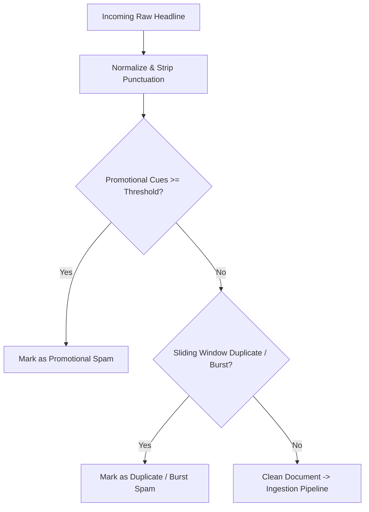

# FinText Spam Detector (`fintext_spam_detector`)

> **Last Verified**: 2026-09-10 (Suite #96) | **Audit Readiness**: Certified Clean | **Authoritative Deprecations**: [`docs/DEPRECATED.md`](../../docs/DEPRECATED.md)

## 1. Module Name & Purpose
`fintext_spam_detector` is a real-time sliding-window noise filter and social manipulation detector. It identifies promotional spam, pump-and-dump rhetoric, duplicate headline spam, and bot burst activity across financial news streams and social feeds (StockTwits, Reddit, Twitter/X).

## 2. Architecture
- **Heuristic Pattern Analysis**:
  - `PUMP_REGEXES`: Flags promotional idioms (e.g. `to the moon`, `100x`, `guaranteed returns`, `short squeeze`, `diamond hands`, `buy now`).
  - `PUMP_EMOJIS`: Flags emoji spam clusters (🚀, 💎, 🦍, 🌕, 💸, 🔥).
- **Duplicate Detection**: Maintains a thread-safe sliding time window (`title_window: Mutex<VecDeque<(f64, String)>>`) to detect identical normalized headlines within `window_seconds`.
- **Burst Rate Limiting**: Tracks publication velocity per source/ticker to throttle bot flooding attacks.



## 3. Dependencies
| Dependency | Version | Purpose |
| :--- | :--- | :--- |
| `regex` | `1.10` | Compiled regular expression matching for pump phrases |
| `once_cell` | `1.19` | Lazy initialization of compiled regex vector |
| `pyo3` | `0.29` | Optional Python C-extension bindings (`cdylib`) |

## 4. Public API
- `pub fn is_spam_heuristic(text: &str) -> (bool, &'static str)`: Heuristic text spam detection.
- `pub struct RustSpamDetector`: Sliding window spam detector maintaining state over time:
  - `pub fn check_spam(&self, title: &str, current_time: Option<f64>) -> (bool, String)`

## 5. Testing
Run crate unit tests:
```bash
cargo test -p fintext_spam_detector
```

## 6. Usage Example
```rust
use fintext_spam_detector::RustSpamDetector;

let detector = RustSpamDetector::new(Some(60.0), Some(3), Some(5));

let (is_spam, reason) = detector.check_spam("FREE BITCOIN 100x GUARANTEED TO THE MOON 🚀💎", None);
assert!(is_spam);
assert_eq!(reason, "promotional_language");
```

## 7. Related Modules
- [`fintext_ingestion_engine`](../ingestion_engine): Filters out noisy articles before feeding ONNX FinBERT models.
- [`fintext_api_server`](../api_server): Enforces spam penalties during data quality score calculation.
