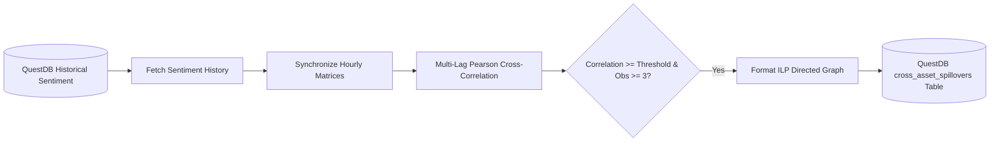

# FinText Cross-Asset Spillover Engine (`fintext_spillover_engine`)

> **Last Verified**: 2026-09-10 (Suite #96) | **Audit Readiness**: Certified Clean | **Authoritative Deprecations**: [`docs/DEPRECATED.md`](../../docs/DEPRECATED.md)

## 1. Module Name & Purpose
`fintext_spillover_engine` is a quantitative analytics engine that detects lead-lag relationships and systemic sentiment spillover effects across multi-asset universes. It synchronizes hourly sentiment time series from QuestDB, computes multi-horizon Pearson cross-correlation matrices, identifies statistically significant transmission channels, and persists directed spillover graphs back to QuestDB ILP.

## 2. Architecture
- **Time Series Synchronization (`timeseries.rs`)**: Aggregates event-level sentiment records into hourly aligned matrices per asset, filtering out low-liquidity/low-activity tickers.
- **Cross-Correlation Computation (`correlation.rs`)**: Scans lead-lag horizons (e.g. $-k$ to $+k$ hours) to compute Pearson correlation coefficients and observation counts.
- **QuestDB Integration (`questdb.rs`)**: Reads historical sentiment time series via HTTP SQL (`/exec`) and writes computed spillovers via Influx Line Protocol (ILP).
- **Orchestrator Engine (`engine.rs`)**: Manages the scan lifecycle, threshold filtering, and ILP persistence.



## 3. Dependencies
| Dependency | Version | Purpose |
| :--- | :--- | :--- |
| `tokio` | `1.36` | Asynchronous task scheduling and timer loop |
| `reqwest` | `0.11` | HTTP client for QuestDB SQL and ILP REST endpoints |
| `serde` / `serde_json` | `1.0` | JSON serialization of matrix results |
| `chrono` | `0.4` | Timestamp alignment and date math |
| `tracing` | `0.1` | Structured logging |

## 4. Public API
- `pub struct SpilloverEngine`: Primary orchestrator for scanning and publishing spillovers.
- `pub struct SpilloverConfig`: Configuration struct (`questdb_url`, `lookback_days`, `max_lag_hours`, `min_correlation_threshold`, `min_active_hours`, `max_tickers`).
- `pub fn compute_cross_correlation(series_a: &[f64], series_b: &[f64], max_lag: usize) -> (i64, f64, usize)`: Computes optimal lag and Pearson correlation.
- `pub fn build_synchronized_matrix(events: &[SentimentEvent], min_active_hours: usize, max_tickers: usize) -> (Vec<i64>, HashMap<String, Vec<f64>>)`: Aligns discrete events into an hourly grid.
- `pub fn format_spillovers_ilp(spillovers: &[SpilloverResult], timestamp_nanos: i64) -> String`: Formats ILP records for ingestion.

## 5. Testing & Running
Run unit and integration tests:
```bash
cargo test -p fintext_spillover_engine
```

Run standalone binary:
```bash
cargo run --release -p fintext_spillover_engine
```

## 6. Usage Example
```rust
use fintext_spillover_engine::{compute_cross_correlation, pearson_correlation};

let series_a = vec![0.1, 0.4, 0.8, -0.2, 0.5];
let series_b = vec![0.0, 0.1, 0.4, 0.8, -0.2]; // B follows A with 1-step lag

let (best_lag, max_corr, obs) = compute_cross_correlation(&series_a, &series_b, 2);
assert_eq!(best_lag, 1);
assert!(max_corr > 0.95);
```

## 7. Related Modules
- [`fintext_ingestion_engine`](../ingestion_engine): Produces the underlying sentiment time series stored in QuestDB.
- [`fintext_api_server`](../api_server): Exposes `/risk/spillovers` and `/risk/spillover-matrix` REST endpoints.
